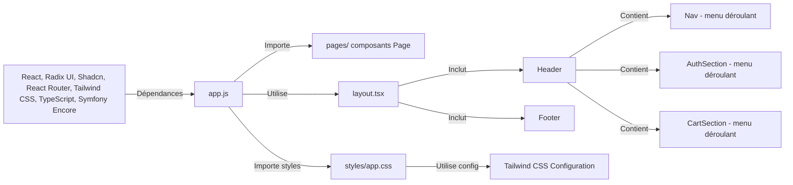

# Assets Documentation

Ce dossier contient le code front-end de l'application.

⚠️ Webpack.Encore prend en charge l'étape de build. Toutes les assets (react compilé en js, css, images) sont compilé dans le dossier public/build et servi tel quel par Symfony.

## Demarrage

```bash
symfony server:start
npm run watch
npm run build
```

go to : <http://127.0.0.1:8000/>

## Principales librairies utilisées

-   **React**: Une bibliothèque JavaScript pour créer des interfaces utilisateur.
-   **RadixUI et Shadcn** : Un ensemble de composants d'interface utilisateur React.
-   **React Router(lib)**: Un ensemble de composants de routage client pour les applications React.
-   **Tailwind CSS**: Le framework CSS.
-   **TypeScript**: Superset de JavaScript.
-   **Symfony Encore**: Un outil pour compiler les actifs frontaux dans les applications Symfony utilisant Webpack.

## Structure des dossiers

### app.js

Le point d'entrée de l'application front (même si l'authentique ptn d'entré c'est base.html.twig donc de HTML). Dans webpack.config.js :

```js
/*
     * ENTRY CONFIG
     *
     * Each entry will result in one JavaScript file (e.g. app.js)
     * and one CSS file (e.g. app.css) if your JavaScript imports CSS.
     */
    .addEntry("app", "./assets/app.js")
```

### components/

Contient des composants React réutilisables. Le dossier UI (components/ui) contient des composants dédié exclusivement à de l'interface utilisateur Shadcn/Radix.

#### exemple d'un composant

[Header.tsx]("/components/Header.tsx") :

-   Composant principal = Header,
-   3 menus déroulant :
    -   Nav pour la navigation,
    -   AuthSection pour l'authentification
    -   CartSection pour le panier.
-   Utilise des sous-composants Radix/Shadcn (100% UI)
-   Utilise des sous-composants personnalisé (100% UI):
    -   CartProduct présente les produits du panier
    -   Input pour les formulaires
    -   Button pour les boutons
    -   Content est un composant Radix pour les contenus des menus déroulant
    -   Subtitle est un composant Radix pour les label des menus déroulants
    -   Box est un élément soit div soit form

### images/

Contient des images utilisées dans l'application.
Compilé par webpack encore dans le dossier public/build/images.

### layout.tsx

Contient le layout de toutes les pages de l'application. Tous ce que les pages ont en commun (Header, Footer, et main)

```tsx
<>
    <Header links={links} />
    <main className="relative w-screen flex flex-col min-h-screen">{children}</main>
    <Footer />
</>
```

### pages/

Un fichier = une page de l'application. Les composants Pages sont importé dans app.js et distribuer en fonction des routes :

```tsx
<Routes>
    {links.map((link) => {
        const { Page, href, label } = link;
        return (
            <Route
                key={label}
                path={href}
                element={
                    <Layout links={links}>
                        <Page />
                    </Layout>
                }
            />
        );
    })}
</Routes>
```

### styles/

Contient les fichiers de styles. app.css est point d'entrée des styles tailwind.

### types.ts

Fichiers avec des types TypeScript exporté vers les autres fichiers.

### utils.ts

Contient des fonctions utilitaires.

## Tailwind CSS Configuration

Contient la configuration de Tailwind CSS dont les éléments d'identité visuelle comme :
⚠️ pas à jour

```js

colors: {
                primary: "#093C6F",
                secondary: "#D6AD3A",
                dark: {
                    primary: "#1D1D1F",
                    secondary: "#2C2C2C",
                },
                grey: "#757575",
            },

```

### Diagramme de composants


